# Einführung in ein Framework

_Automatisch aus PDF konvertiert_

<!-- Seite 1 -->

Einführung in ein Framework 
 
 
 
 

<!-- Seite 3 -->

Vorwort 
 
 
React wird in der Zukunft im Zuge der fortschreitenden Digitalisierung vielen Programmierern 
in ihrem Arbeitsumfeld begegnen. Sowohl für Web- als auch Mobileanwendungen ist das 
Framework state oft the art und hat mit Facebook ein zukunftsorientiertes Unternehmen im 
Rücken, das für die weitere Verbesserungen und Weiterentwicklung steht.  
Auf den folgenden Seiten soll Ihnen ein leichter Einstieg im Umgang mit dem Framework React 
nähergebracht werden. Sie sollten bereits einige Vorkenntnisse in einer objektorientierten 
Programmiersprache gesammelt haben, wie zum Beispiel Java, C++ oder Python. Auch 
Vorkenntnisse in JavaScript und XML sind hilfreich, in beide Sprachen wird jedoch im 
Folgenden auch noch einmal eingegangen. Das folgende eBook wird aus Ihnen keinen React-
Profi machen, soviel vorweg, es soll Ihnen jedoch eine gesunde Grundlage und alle nötigen 
Kenntnisse für einen sicheren und stabilen Einstieg liefern.  
Der Kurs ist in Text mit Programmierbeispielen und sechs Übungsaufgaben aufgeteilt. Im 
Fließtext werden Ihnen der Background und die Grundlagen zusammengefasst, die 
Aufgabenstellungen werden Sie in Eigenarbeit lösen, eine Musterlösung zu jeder Aufgabe 
finden Sie am Ende des Buchs in Kapitel 7 – Lösungen.  
Wir wünschen Ihnen viel Spaß mit dem Tutorial und hoffen, dass es Ihnen einen leichten und 
sicheren Start im Arbeiten mit React ermöglicht. 
 
 
 
 
 
 
 
 
 

<!-- Seite 4 -->

Inhalt 
Vorwort ................................................................................................ 2 
Kapitel 1 – Grundlagen ................................................................................. 5 
1.1. Wiederholung - Was ist ein Framework? ............................................................. 5 
1.2. Was ist React? .................................................................................... 5 
1.3. Der Aufbau von React .............................................................................. 6 
1.4. Wiederholung – DOM ......................................................................................................... 7 
1.5. Einstieg in React .................................................................................................................. 8 
1.5.1. Entwicklungsumgebung ....................................................................................................................... 8 
1.5.2. Installation ............................................................................................................................................ 8 
1.5.3. Die erste App ........................................................................................................................................ 9 
1.5.4. Bearbeitung der App ............................................................................................................................ 9 
1.5.5. Integriertes Terminal .......................................................................................................................... 10 
Kapitel 2 – Kurzeinführung in XML und JavaScript ........................................................ 11 
2.1. XML (eXtensible Markup Language) ............................................................................... 11 
Aufgabe 1 .................................................................................................................................................... 12 
Kapitel 3 - Aufbau und Struktur ....................................................................................... 19 
3.1. Aufbau einer React-App: ................................................................................................... 19 
3.2. Komponenten: ................................................................................................................... 20 
3.2.1. Datentypen, Variablen und Funktionen .............................................................................................. 21 
Kapitel 4 - Oberflächen .................................................................................................... 22 
4.1. Eventhandling: .................................................................................................................. 22 
4.2. Data Binding: ..................................................................................................................... 23 
Aufgabe 2 .................................................................................................................................................... 25 
4.3. Formularverwaltung: ........................................................................................................ 26 
4.3.1. Textarea .............................................................................................................................................. 28 
4.3.2. Select .................................................................................................................................................. 29 
Aufgabe 3 .................................................................................................................................................... 31 
4.3.3. Styling: ............................................................................................................................................... 32 
Aufgabe 4 .................................................................................................................................................... 34 
Kapitel 5 - Eventplaner .................................................................................................... 35 
5.1. Listen ................................................................................................................................. 35 
Aufgabe 5 .................................................................................................................................................... 42 
Kapitel 6 - Verwendung einer REST-API ......................................................................... 43 
Aufgabe 6 .................................................................................................................................................... 45 
Kapitel 7 – Lösungen ....................................................................................................... 46 
Aufgabe 1 – Lösung .................................................................................................................................... 46 
Aufgabe 2 – Lösung .................................................................................................................................... 47 
Aufgabe 3 – Lösung .................................................................................................................................... 48 
Aufgabe 4 – Lösung .................................................................................................................................... 50

<!-- Seite 5 -->

Aufgabe 5 - Lösung .................................................................................................................................... 53 
Aufgabe 6 – Lösung .................................................................................................................................... 57 
Referenzen ....................................................................................................................... 63 
Abbildungsverzeichnis ..................................................................................................... 64

<!-- Seite 6 -->

Abbildung 1: Einige bekannte Unternehmen, die mit React entwickeln 
Kapitel 1 – Grundlagen  
 
1.1. Wiederholung - Was ist ein Framework? 
 
Ein Framework (engl. Gerüst oder Rahmen) ist eine Vorprogrammierung, die einfach in eigene 
Programme eingebunden werden kann. Ein Framework bietet dabei eine Vielzahl von 
vorgefertigten Anwendungsmöglichkeiten und vereinfacht die Programmierung extrem. 
Die Vorteile eines Frameworks sind vielfältig, zum Beispiel verringert die Verwendung eines 
Frameworks die Kosten, Dokumentation und Unterstützung wird durch eine Community meist 
in sehr umfangreichem Maß gegeben und die Entwicklungsgeschwindigkeit wird durch die 
vorgefertigten Komponenten erhöht.  
Frameworks haben natürlich bei all diesen Vorteilen auch Nachteile: Die Struktur eines 
Frameworks ist vorgegeben, das heißt, jedes Framework hat seine Grenzen, an die man sich 
anpassen muss. Die Benutzung eines Frameworks vereinfacht zwar die Arbeit, man lernt aber 
auch nur sich mit der Programmiersprache zu arrangieren, ein tiefer Einblick in das Coden mit 
der jeweiligen Sprache wird selten erreicht. Frameworks können außerdem Sicherheitslücken 
aufweisen, da der Quellcode in den meisten Fällen frei zugänglich ist und somit von jedem 
eingesehen werden kann. Missbrauch wäre hier denkbar und möglich, dieser Tatsache muss 
man sich beim Umgang mit Frameworks ebenfalls bewusst sein. 
 
1.2. Was ist React? 
 
React ist eine JavaScript Bibliothek für Benutzeroberflächen, die von Facebook im Jahr 2013 
veröffentlich wurde. Das Ziel ist ein einfacher Code mit geringer Komplexität und verbesserter 
Lesbarkeit. Dadurch sollte die Software leicht zu warten sein und Fehler einfach zu beheben 
sein. Die auf den folgenden Seiten verwendete Version ist 16.6.3. 
i

<!-- Seite 7 -->

React ist im Gegensatz zu anderen, ähnlichen Frameworks relativ weit verbreitet: 
 
 
Abbildung 2: Verbreitung Frameworks (Quelle: TechMagic. (2018))  
 
1.3. Der Aufbau von React 
 
Komponenten sind ein zentraler Bestandteil von React. Mit Hilfe von Komponenten wird der 
Code übersichtlich gehalten und der Austausch einzelner Komponenten wird stark vereinfacht. 
Browserkompatibilität wird in React durch synthetische Events realisiert. Der virtuelle DOM 
wird zur Performanceverbesserung benötigt. Diesen betrachten wir im Folgenden noch etwas 
genauer. 
 
 
Abbildung 3: React Architektur (Quelle: TechMagic. (2018))

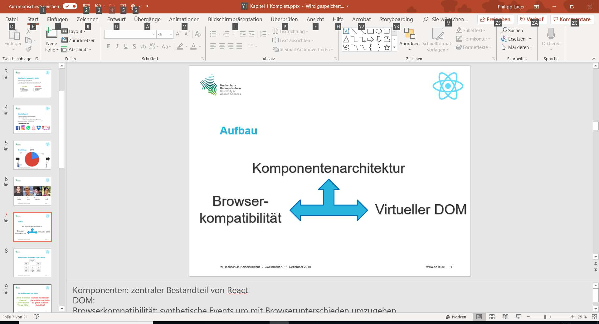

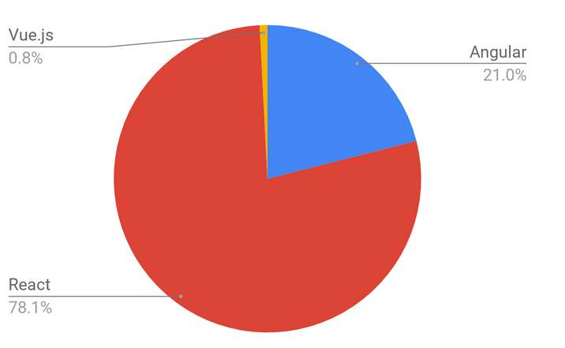

<!-- Seite 8 -->

1.4. Wiederholung – DOM 
 
DOM (Document Object Model) ist eine Programmierschnittstelle, die Programmen und 
Skripten erlaubt, Content und Struktur eines Dokuments dynamisch zu verändern. In HTML 
und XML kann dies als Baumstruktur dargestellt werden: 
 
Dabei stellt jeder Knoten ein Objekt 
dar. Die Architektur ist hierarchisch 
aufgebaut. Es gibt einen Wurzelknoten 
und mehrere Kinder. 
Der Vorteil ist, dass diese Struktur 
sowohl 
Plattform- 
als 
auch 
Programmiersprachenunabhängig 
ist 
und somit übergreifend verwendet 
werden kann. 
 
 
Die Vor- und Nachteile eines Frameworks an sich haben Sie vorhin schon kennen gelernt. Die 
Bibliothek React hat allerdings auch noch eigene Vor- und Nachteile. 
React ist relativ einfach zu lernen. Mit Grundfähigkeiten in HTML kann es ohne Probleme 
genutzt werden. Im Gegensatz zu Angular bspw. wird kein TypeScript (eine von Microsoft 
entwickelte syntaktische Spracherweiterung von JavaScript) benötigt. React ist eine Open-
Source JavaScript-Bibliothek, die ständig Updates und Erweiterungen erhält.  Der virtuelle 
DOM erlaubt es, Dokumente in HTML, XHTML und XML zu verwenden und verbessert somit 
die Browserakzeptanz. 
 
 
Abbildung 4: DOM Baumstruktur

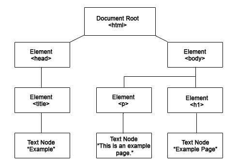

<!-- Seite 9 -->

1.5. Einstieg in React 
 
1.5.1. Entwicklungsumgebung 
 
Bei der Entwicklungsumgebung gibt es verschiedene Möglichkeiten, die meisten üblichen 
Programmier-Umgebungen werden für die React Entwicklung unterstützt.  
Die Übungen in diesem Tutorial werden mit Hilfe von Visual Studio Code und Node.js 
bearbeitet. Visual Studio Code ist ein kostenloses Tool und kann hier heruntergeladen werden: 
https://code.visualstudio.com/ 
Node.js ist eine serverseitige Plattform zum Betrieb von Netzwerkanwendungen, die in 
unserem Fall einen Webserver bietet. Dieser wird benötigt, da React, im Gegensatz zu HTML, 
serverseitig ausgeführt wird.  
Node.js kann unter folgendem Link heruntergeladen werden: 
https://nodejs.org/en/ 
 
1.5.2. Installation 
 
Folgen Sie sowohl bei Visual Studio Code als auch bei Node.js den jeweiligen 
Installationsanleitungen. 
Nach erfolgreicher Installation starten sie Node.js command prompt 
 
Als erstes müssen Sie den App-Generator mit folgendem Befehl installieren, in dem sie über 
cmd.exe auf die Konsole ihres Rechners zugreifen: 
 
npm install -g create-react-app

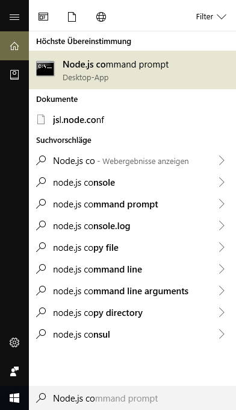

<!-- Seite 10 -->

1.5.3. Die erste App 
 
Nach der Installation des App-Generators können Sie nun Ihre erste App erstellen: 
Dazu geben Sie folgende Befehle ein: 
 
create-react-app uebung1.  
 
cd uebung1 
 
npm start 
(uebung1 entspricht dem Namen der App) 
 
Die App wurde nun erstellt, Sie haben in das Verzeichnis gewechselt und Ihre App samt 
Webserver gestartet. Es öffnet sich im Normalfall nun ein Browserfenster mit der App.  
Falls sich das Fenster nicht von selbst öffnet, kann die App auch manuell über folgenden Link 
in ihrem übliche verwendeten Internetbrowser gestartet werden: 
http://localhost:3000/ 
 
1.5.4. Bearbeitung der App 
 
Um die App im Weiteren bearbeiten zu können, müssen Sie diese in Visual Studio Code öffnen. 
Dazu öffnen Sie ein weiteres Node.js-Konsolenfenster und geben folgende Befehle ein: 
 
cd uebung1 
 
code . 
 
Wichtig: Der Punkt Ist kein Tippfehler!

<!-- Seite 11 -->

Visual Studio Code sollte sich nun öffnen und folgendes zu sehen sein: 
1 
Abbildung 5: Visual Studio Code 
 
1.5.5. Integriertes Terminal 
 
Die Benutzung der Node.js Eingabeaufforderung kann umständlich sein, Visual Studio Code 
bietet jedoch eine einfache Hilfe: Das integrierte Terminal.  
Dieses können Sie in Visual Studio unter Terminal aufrufen: 
 
Abbildung 6: Terminal Übersicht 
Im Terminal können Sie nun ebenfalls die App starten mit dem Befehl: 
 
npm start 
Das integrierte Terminal kann die gleichen Aufgaben übernehmen und genauso verwendet 
werden wie die Node.js Eingabeaufforderung. 
 
 
1 Alle Programmierteile wurden in Microsoft Visual Studio Code angelegt und davon per Screenshot 
aufgenommen.

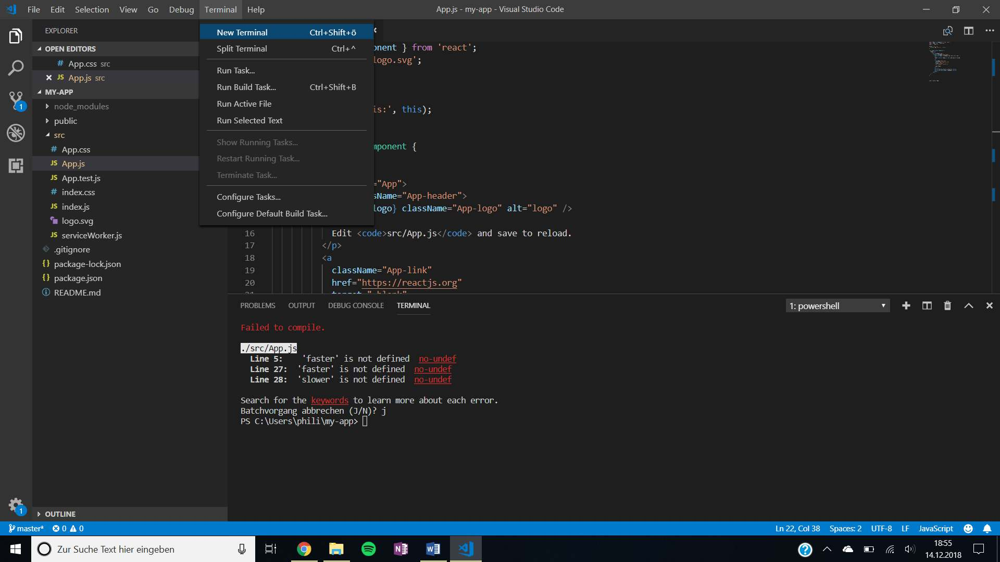

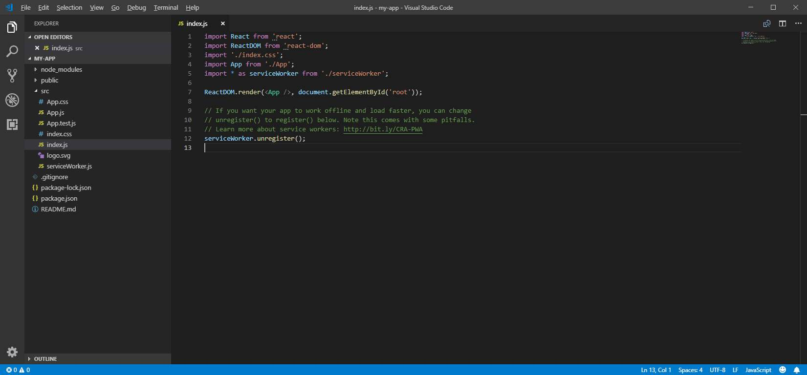

<!-- Seite 12 -->

Kapitel 2 – Kurzeinführung in XML und JavaScript  
 
2.1. XML (eXtensible Markup Language)  
 
XML ist ein Format, um Daten strukturiert und hierarchisch erfassen zu können. XML ist weit 
verbreitet in der Softwareentwicklung und gehört zum Allgemeinwissen eines jeden 
Softwareentwicklers, wird dennoch kurz zur Wiederholung hier nochmal aufgeführt. Eingesetzt 
wird es häufig bei der Strukturierung und Verarbeitung von Daten. 
XML Dokumente bestehen aus Entitys und Tags. Diese werden mit Vergleichszeichen (< und 
>) umschlossen. Jedes Entity kann mehrere Tags enthalten.  
Betrachten wir als Beispiel folgendes Baumdiagramm: 
 
Abbildung 7: Baumdiagramm für Codebeispiel 
 
Dieses Diagramm kann durch die hierarchische Struktur von XML ohne Probleme in Code 
umgewandelt werden: 
 
Abbildung 8: Codebeispiel für XML 
<?xml version=“1.0“ encoding=“ISO-8859-1“ standalone=“yes“ ?> 
<person> 
   <name> 
       <vorname>Max</vorname> 
       <nachname>Mustermann</nachname> 
   </name> 
   <beruf>Informatiker</beruf> 
</person>

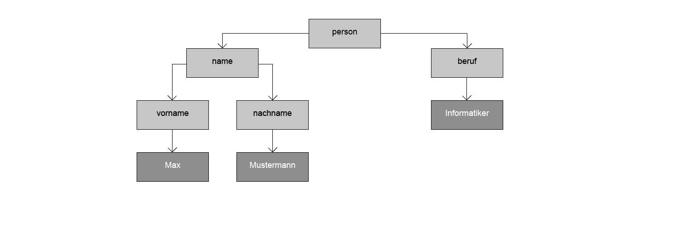

<!-- Seite 13 -->

Wir sehen: es gibt ein Wurzelelement bzw. Entity (Person) mit mehreren Tags (Name und 
Beruf). Der Tag Name (wiederum auch ein Entity) hat wiederum die Tags Vorname und 
Nachname.  
Da wir die Namen der Tags frei wählen können, sind gleiche Namen auf unterschiedlichen 
Ebenen denkbar. Zur besseren Lesbarkeit sollte dies jedoch in der Regel vermieden werden. 
 
 
Aufgabe 1 
 
Legen Sie folgende Entity in einem strukturierten XML Dokument an und füllen Sie die Tags 
mit sinnvollen Werten. 
 
Abbildung 9: Aufgabe 1 
 
Die Lösungen zu allen Aufgaben finden Sie unter Kapitel 7 – Lösungen.

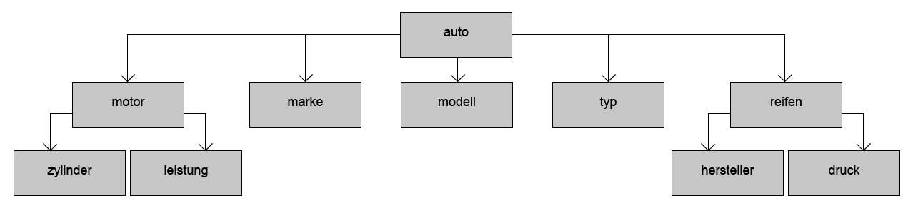

<!-- Seite 14 -->

2.2. JavaScript 
 
JavaScript ist eine Skriptsprache, die vor allem im Zusammenhang mit Webanwendungen 
verwendet wird. Abgesehen von der Namensähnlichkeit hat sie nichts mit der 
Programmiersprache Java zu tun. Mit JavaScript lassen sich Funktionalitäten ermöglichen, die 
mit „Web 2.0“ verbunden werden. JavaScript ist eine objektorientierte, dynamische und 
prototype-basierte Sprache. 
Webanwendungen bestehen immer aus 3 Komponenten: Inhalt, Präsentation und Verhalten. 
Inhalt und Präsentation werden meist durch HTML und CSS realisiert. Mit JavaScript setzen 
wir das „Verhalten“ um. JavaScript ist jedoch nur als Ergänzung zu Standardverhalten von 
HTML anzusehen. 
 
Datentypen in JavaScript werden durch Inhalte von Variablen bestimmt. Es wird keine direkte 
Deklaration durchgeführt.  
Folgende Datentypen gibt es: 
- 
Undefined 
- 
Null 
- 
String 
- 
Number 
- 
Boolean 
Die Bedeutung der meisten Datentypen sollte Ihnen bereits bekannt vorkommen. Neu ist der 
Datentyp „Undefined“, welcher allen nicht initialisierten Variablen zugewiesen wird. 
Der in folgenden Beispielen verwendete Befehl alert ist ein Ausgabebefehl, der die 
nachfolgende Ausgabe in einem Dialogfenster im Browser ausgibt. 
Mit dem type-Operator lassen sich die Datentypen abfragen: 
 
Abbildung 10: TypeOf verschiedener Variablen 
 
var mixedVariable; 
alert( typeof mixedVariable ); // 'undefined' 
mixedVariable = 'Fred Feuerstein'; 
alert( typeof mixedVariable ); // 'string' 
mixedVariable = 19; 
alert( typeof mixedVariable ); // 'number' 
mixedVariable = null; 
alert ( typeof mixedVariable ); // 'null' 
mixedVariable = True; 
alert ( typeof mixedVariable ); // 'boolean'

<!-- Seite 15 -->

Operatoren in JavaScript funktionieren wie in den meisten anderen Programmiersprachen 
auch, es gibt jedoch einige Besonderheiten. Schauen wir uns die Operatoren in folgenden 
Beispielen etwas an: 
 
Rechenoperatoren können benutzt werden wie üblich. JavaScript achtet dabei auf Punkt vor 
Strich! 
 
Abbildung 11: Beispiel Rechenoperatoren 
 
Vergleichsoperatoren und logische Operatoren werden ebenfalls verwendet wie üblich: 
 
Abbildung 12: Beispiel Vergleichsoperatoren 
 
Es gibt jedoch eine Besonderheit. JavaScript bietet die Möglichkeit eines typgenauen 
Vergleichs. Dieser ist true, wenn beide Werte gleich sind und den gleichen Typ haben: 
 
Abbildung 13: Beispiel typgenauer Vergleich 
 
var zwei           = 1 + 1, 
   nix            = 2 - 2, 
   auchNix        = 81 / 3 - 27, 
   wenigerAlsNix  = 81 / (3 - 27), 
   SinnDesLebens  = 6 * 7, 
var sinnDesLebens = 42, alter = 8; 
if (sinnDesLebens == 42) alert("Richtig."); 
if (sinnDesLebens != 42) alert("Falsch."); 
if (sinnDesLebens > 42)  alert("Falsch."); 
if (sinnDesLebens < 42)  alert("Falsch."); 
var number1 = 1; 
var number2 = 2; 
var text = "text"; 
if (number1 === number2) alert("Richtig."); 
if (number1 !== text) alert("Richtig."); 
if (number2 === text) alert("Falsch.");

<!-- Seite 16 -->

JavaScript bietet von Haus aus verschiedene Objektarten an: 
- 
Array 
- 
Object 
- 
Function 
Arrays sollten Ihnen bereits aus anderen Programmiersprachen bekannt sein. Mit diesen lassen 
sich mehrere gleichartige Strukturen in einem Feld „sammeln“: 
 
Abbildung 14: Arrays Beispiel 
 
In Objekten in JavaScript können beliebig verschachtelte Schlüssel-Wert-Paare abgelegt 
werden. Schlüssel und Wert werden hierbei durch einen Doppelpunkt voneinander getrennt. 
 
Abbildung 15: Objects Beispiel 
 
 
 
// Meine Freunde als Einzelvariablen 
var freund_1 = 'Peter'; 
var freund_2 = 'Paul'; 
var freund_3 = 'Mary'; 
// oder als Sammlung in der Form eines Arrays 
var freunde = [ 
'Peter', 
'Paul', 
'Mary' 
]; 
// Ein neues Objekt in literaler 
// Schreibweise erzeugen: 
var unserObjekt = {}; 
// Bei der Erzeugung eines Objektes 
// können die Werte bereits mit angegeben werden: 
var australia = { 
capitol : 'Canberra', 
population : 21360000, 
area: '7.692.030 squarekilometer', 
isContinent: true 
};

<!-- Seite 17 -->

Funktionen in JavaScript sind immer Objekte erster Ordnung. Sie können zur Laufzeit erzeugt, 
in Variablen gespeichert und wie andere Objekte zwischen verschiedenen Elementen 
übergeben werden. Funktionen enthalten Teile eines größeren Programms und werden für einen 
wiederverwendbaren Code benötigt. Es gibt verschiedenen Arten Funktionen in JavaScript zu 
erzeugen.  
Zwei davon werden in folgendem Beispiel gezeigt: 
 
Abbildung 16: Functions Beispiel 
 
Natürlich bietet JavaScript auch noch die Möglichkeit weitere Spezialobjekte zu verwenden, 
wie beispielsweise für Datumskalkulationen, reguläre Ausdrücke und mathematische 
Berechnungen.  
Für nähere Informationen informieren Sie sich gerne zum Beispiel in einer JavaScript 
Bibliothek oder in einem dafür vorgesehen Forum. 
 
 
// In einer an andere Sprachen erinnernden Form: 
function hallo() { 
   alert( 'Guten Tag!' ); 
   } 
 // speichern einer Funktion in einer Variable: 
 var tschuess = function() { 
   alert( 'Auf Wiedersehen!' ); 
 };

<!-- Seite 18 -->

Auch in JavaScript gibt es verschiedene Kontrollstrukturen. Es gibt Bedingungsanweisungen 
(if-else) und verschiedene Schleifen (for und while). 
Diese werden in nachfolgenden Beispielen gezeigt: 
 
Abbildung 17: If-Else Beispiel 
 
 
Abbildung 18: Beispiel einer For-Schleife 
 
 
 
 
// <ausdruck> ist ein Platzhalter 
if ( <ausdruck> ) { 
   // Anweisungen für den Fall, dass 
   // <ausdruck> als true ausgewertet wird 
   } else { 
   // Anweisungen, die ansonsten ausgeführt werden 
   }   
// Pseudocode 
for( <initalisierung>; <abbruchbedingung>; <variablenaenderung> ) { 
   // JavaScript-Code 
   } 
  
// Um also die Zahlen von 1-10 auszugeben, 
// kann die folgende Schleife verwendet werden: 
 for(var i = 1; i <= 10; i++) { 
   alert( i ); 
   }

<!-- Seite 19 -->

Fehler in syntaktisch korrektem JavaScript-Code können in JavaScript abgefangen werden, um 
eine Fehlerbehandlung zu implementieren: 
 
Abbildung 19: Beispiel Exception 
 
 
Events werden benötigt, um die Interaktion des Benutzers mit der Oberfläche der Anwendung 
umzusetzen. So können beispielweise bei Klick eines Buttons verschiedene Funktionen 
ausgelöst werden. 
Die Verknüpfung eines Events mit einem Klickbaren Objekt in JavaScript kann 
folgendermaßen realisiert werden: 
 
Abbildung 20: Beispiel Eventhandling 
 
 
 
try { 
   // Hier könnten fehlerhafte, aber syntaktisch 
   // richtige Befehle stehen... vgl. Beispiel 
   // weiter unten 
   } catch (e) { 
   // ... die entsprechenden exceptions werden hier verarbeitet 
   // in der Variable e steht ein Informationstext... 
   } finally { 
   // Hier kommt man in jedem Falle hin. 
   } 
// Das DOM Element per ID bekommen: 
var div = document.getElementById( 'id_des_divs' ); 
div.onclick = func;

<!-- Seite 20 -->

Kapitel 3 - Aufbau und Struktur 
 
3.1. Aufbau einer React-App:  
 
In Ihrer vorhin im Rahmen des letzten Übungsblatt erstellten App wurden einige Dateien für 
Sie automatisch angelegt: 
node_modules: 
Diese Dateien werden zur Verwendung und Ausführung der 
App mit Hilfe des Webpack (Open-Source-JavaScript-Modul-
Bundler) benötigt. Diese Dateien werden von Node.js immer 
selbst erstellt und müssen bei Export eines Projekts nicht 
mitgeliefert werden. 
public: 
Die hier abgelegten Dateien werden nicht vom Webpack 
mitgelesen. Es dürfen also keine JavaScript-, CSS- oder Asset-
Files in diesem Ordner abgelegt werden. Wichtig ist eigentlich 
nur, dass das Favicon hier liegt und die index.html (das HTML 
Template der App). React rendert die Elemente mit der Render-
Funktion in diese Template-Datei. 
src: 
Hier werden Sie sämtlichen Code speichern. Alle Komponenten 
und Style-Dateien werden hier erstellt und abgespeichert. 
 
 
Erste Änderungen: 
Um nun Änderungen an der automatisch erstellten Beispiel-App durchführen zu können, öffnen 
Sie bitte in Visual Studio Code (VSC) das Projekt und darin die Datei App.js. Als erste 
Änderung werden Sie ein „Hello World“ implementieren. Dazu ersetzen Sie den Inhalt des div-
Containers mit folgendem Code: 
 
Anschließend Speichern Sie Ihr Projekt (Strg+S), öffnen das intergierte Terminal und starten 
die App mit npm start 
 
 
<h1>Hello World</h1> 
Abbildung 20: Aufbau einer React-
App 
Abbildung 21: Aufbau einer React-
App

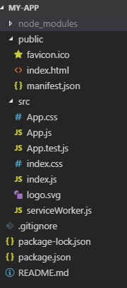

<!-- Seite 21 -->

3.2. Komponenten: 
 
React basiert auf einer Komponentenstruktur, die hierarchisch aufeinander aufgebaut sind.  
Komponenten sind logisch getrennte Einheiten, die unabhängig voneinander behandelt werden. 
Jede Komponente wird in einer extra JavaScript-Datei erstellt und dann in die App importiert. 
Die App uebung1 soll nun so verändert werden, dass „Hello World“ eine eigene Komponente 
wird. Dazu erstellen Sie zunächst einen neuen Ordner, indem Sie alle Ihre Komponenten 
abspeichern: 
 
Abbildung 22: Ordner erstellen für Komponenten 
Anschließend erstellen Sie eine neue Datei helloworld.jsx innerhalb des Ordners: 
 
Abbildung 23: Neue Datei im Ordner erstellen 
VSC erzeugt eine leere .jsx-Datei. Es wäre sehr umständlich immer alle Komponenten komplett 
von Hand schreiben zu müssen. VSC bietet die Möglichkeit Erweiterungen zu installieren. Eine 
für uns sehr hilfreiche wird Simple React Snippets. Zur Installation öffnen Sie das Extensions-
Menu (Strg+Shift+X). Dort suchen Sie unsere Extension und klicken auf Install. Danach starten 
Sie VSC neu. Nun haben Sie eine Eingabeerleichterung mittels Shortcuts und autocomplete. 
Diese werden Ihnen als Vorschlag bei Eingabe angezeigt: 
 
 
Abbildung 24: Autocomplete import

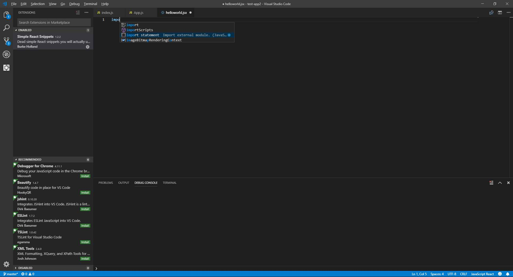

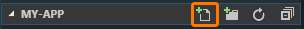

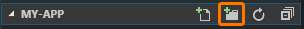

<!-- Seite 22 -->

Der Erste Schritt bei der Erstellung einer React-Komponente ist der Import von React: 
(Tipp: Der Shortcut hierfür ist imrc) 
 
Abbildung 25: React import 
 
Anschließend erstellen Sie in der Komponente eine Klasse HelloWorld (Tipp: Shortcut cc): 
 
Abbildung 26: Klasse erstellen in Komponente 
 
Im Anschluss müssen Sie Ihre Komponente noch in die index.js importieren und kompilieren: 
(Der Code aus dem ersten Beispiel in der App.js kann entfernt werden) 
 
Abbildung 27: Komponente in index.js importieren 
 
 
 
3.2.1. Datentypen, Variablen und Funktionen 
 
Da React eine JavaScript-Bibliothek ist, sind Datentypen, Variablen und Funktionen wie in 
JavaScript zu verwenden. Zur Wiederholung schauen Sie sich erneut das Ergänzungsblatt zur 
vorherigen Übung an. 
 
 
import React, { Component } from 'react'; 
class HelloWorld extends Component { 
   state = {  } 
   render() {  
       return <h1>Hello World</h1>; 
   } 
} 
export default HelloWorld; 
import HelloWorld from './components/helloworld'; 
ReactDOM.render(<HelloWorld />, document.getElementById('root'));

<!-- Seite 23 -->

Kapitel 4 - Oberflächen 
 
4.1. Eventhandling: 
 
Eventhandling in React erfolgt ähnlich zu Eventhandling bei DOM-Elementen. Die Syntax ist 
ähnlich wie bei HTML aber dennoch leicht unterschiedlich: 
 
Abbildung 28: Eventhandling in HTML 
In React ist es leicht abgeändert: 
 
Abbildung 29: Eventhandling in React 
 
 
 
<button onclick="activateLasers()"> 
   Activate Lasers 
</button> 
<button onClick={activateLasers}> 
 Activate Lasers 
</button>

<!-- Seite 24 -->

4.2. Data Binding: 
 
Klassischerweise werden Änderungen direkt im DOM von einem Event-Handler ausgeführt. 
Beim hier vorgestellten bidirektionalen Data Binding wird jedoch nur das Model geändert. Die 
Änderungen am Model werden vom Framework in den DOM übertragen. Dies sorgt für eine 
klare Trennung und daraus folgend für einen verständlicheren Code. 
 
 
Abbildung 30: App.js mit Parent Komponente und Hauptklasse 
 
 
In der Parent Komponente wird ein Konstruktor mit einem Color-State erstellt, der mit der 
changeColor()-Funktion geändert werden kann. Die changeColor()-Funktion wird der Kind 
Komponente (Siehe Abbildung 4) als prop übergeben.  
class ParentComponent extends Component { 
 constructor(props){ 
   super(props) 
   this.state = { 
     color: 'Select a color' 
   } 
   {/* Hier Binding*/} 
   this.changeColor = this.changeColor.bind(this); 
 } 
 changeColor(newColor){ 
   this.setState({ 
     color: newColor 
   }) 
 } 
} 
class App extends Component { 
 render() { 
   return ( 
     
 
       <header className="App-header"> 
           <ChildComponent changeColor={this.changeColor} /> 
       </header> 
     
 
   ); 
 } 
}

<!-- Seite 25 -->

Abbildung 31: ChildComponent.js mit Kind Komponente 
 
In der Kind Komponente gibt es dann die Eventhandler der Buttons, die auf die changeColor()-
Funktion zurückgreifen. 
 
 
 
 
export default function ChildComponent(props) { 
   const handleClick = e => props.changeColor(e.target.value); 
  
   return ( 
     
 
       <h4>Child Component</h4> 
  
       <button value="Red" onClick={handleClick}> 
         Red 
       </button> 
  
       <button value="Blue" onClick={handleClick}> 
         Blue 
       </button> 
  
       <button value="White" onClick={handleClick}> 
         White 
       </button> 
     
 
   ); 
 }

<!-- Seite 26 -->

Aufgabe 2 
 
Erstellen Sie ein Input-Feld, welches bei Texteingabe in Echtzeit den Text eines 
darüberliegenden Labels ändert. 
 
Abbildung 32: Übung Binding

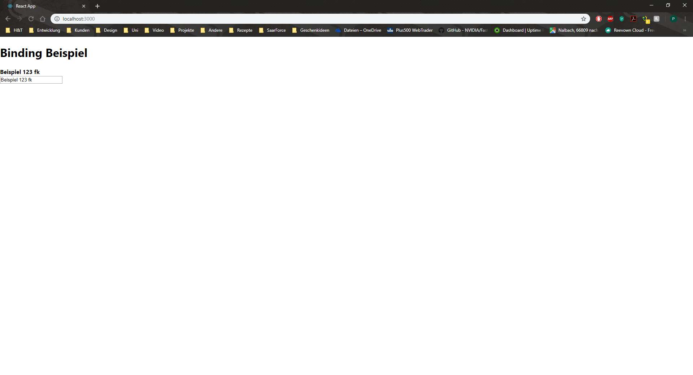

<!-- Seite 27 -->

4.3. Formularverwaltung: 
 
HTML Formulare in React funktionieren anders wie andere DOM Elemente. Die Submit-
Funktion von HTML ruft eine neue Seite auf. Wenn die Funktion gewünscht ist, kann sie 
benutzt werden aber es ist sinnvoll eine Funktion in JavaScript zu schreiben, welches diese 
Funktion übernimmt. 
 
 
Abbildung 33: Einfaches HTML-Formular 
 
In HTML haben Elemente wie <input>, <textarea> oder <select> einen eigenen Status, der 
sich bei Benutzereingaben ändert. In React wird dieser Status nur mit dem Befehl setState() 
geändert. Man kann die beiden zusammen nutzen, indem man der React-Komponente die 
vollständige Kontrolle über das Formular gibt.  
<form> 
 <label> 
   Name: 
   <input type="text" name="name" /> 
 </label> 
 <input type="submit" value="Submit" /> 
</form>

<!-- Seite 28 -->

Abbildung 34: Controlled Component - Formular Beispiel 
 
Da das Value-Attribut immer this.state.value gesetzt wird, hat die React-Komponente die 
alleinige Kontrolle. Da handleChange bei jeder Eingabe des Benutzers ausgeführt wird, sieht 
die Eingabe aus, als wäre sie in Echtzeit.  
 
 
class NameForm extends React.Component { 
   constructor(props) { 
     super(props); 
     this.state = {value: ''}; 
  
     this.handleChange = this.handleChange.bind(this); 
     this.handleSubmit = this.handleSubmit.bind(this); 
   } 
  
   handleChange(event) { 
     this.setState({value: event.target.value}); 
   } 
  
   handleSubmit(event) { 
     alert('Ein Name wurde übergeben: ' + this.state.value); 
     event.preventDefault(); 
   } 
  
   render() { 
     return ( 
       <form onSubmit={this.handleSubmit}> 
         <label> 
           Name: 
           <input type="text" value={this.state.value} onChange={this.hand-
leChange} /> 
         </label> 
         <input type="submit" value="Submit" /> 
       </form> 
     ); 
   } 
 }

<!-- Seite 29 -->

4.3.1. Textarea 
 
In HTML wird der Inhalt einer Textarea über die untergeordneten Kind-Elemente angegeben.  
 
Abbildung 35: Textarea HTML 
React verwendet ein Value-Attribut dafür. Deswegen kann eine Textarea bei React sehr ähnlich 
zu einem normalen einzeiligen Input geschrieben werden: 
 
Abbildung 36: Textarea mit Submit in React 
<textarea> 
 Hier könnte Ihre Werbung stehen 
</textarea> 
class EssayForm extends React.Component { 
   constructor(props) { 
     super(props); 
     this.state = { 
       value: 'Bitte ein Gedicht über Ihr Lieblings-DOM-Element einfügen' 
     }; 
  
     this.handleChange = this.handleChange.bind(this); 
     this.handleSubmit = this.handleSubmit.bind(this); 
   } 
  
   handleChange(event) { 
     this.setState({value: event.target.value}); 
   } 
  
   handleSubmit(event) { 
     alert('Das Gedicht wurde übertragen: ' + this.state.value); 
     event.preventDefault(); 
   } 
  
   render() { 
     return ( 
       <form onSubmit={this.handleSubmit}> 
         <label> 
           Essay: 
       {/* Beginn Textarea */} 
           <textarea value={this.state.value} onChange={this.handleChange} /> 
       {/* Ende Textarea */} 
         </label> 
         <input type="submit" value="Submit" /> 
       </form> 
     ); 
   } 
 }

<!-- Seite 30 -->

4.3.2. Select 
 
In HTML erstellt <select> eine Drop-Down Liste: 
 
Abbildung 37: HTML-Dropdown Beispiel 
In diesem Beispiel ist die „Coconut“-Option zu Beginn ausgewählt, durch das „selected value“-
Attribut. React benutzt ein Value-Attribut im Root-Select-Tag: 
<select> 
 <option value="grapefruit">Grapefruit</option> 
 <option value="lime">Limette</option> 
 <option selected value="coconut">Kokusnuss</option> 
 <option value="mango">Mango</option> 
</select>

<!-- Seite 31 -->

Abbildung 38: React Dropdown Menü 
<input>, <textarea> und <select> funktionieren dank dieser Attribute ziemlich ähnlich. Bei 
allen wird das Value-Attribut benutzt, um eine kontrollierte Komponente zu erzeugen. 
 
 
class FlavorForm extends React.Component { 
   constructor(props) { 
     super(props); 
   {/* Standard Geschmack setzen*/} 
     this.state = {value: 'coconut'}; 
  
     this.handleChange = this.handleChange.bind(this); 
     this.handleSubmit = this.handleSubmit.bind(this); 
   } 
  
   handleChange(event) { 
     this.setState({value: event.target.value}); 
   } 
  
   handleSubmit(event) { 
     alert('Ihr Lieblingsgeschmack ist: ' + this.state.value); 
     event.preventDefault(); 
   } 
  
   render() { 
     return ( 
       <form onSubmit={this.handleSubmit}> 
         <label> 
           Lieblingsgeschmack wählen: 
       {/* Dropdown ab hier*/} 
           <select value={this.state.value} onChange={this.handleChange}> 
             <option value="grapefruit">Grapefruit</option> 
             <option value="lime">Lime</option> 
             <option value="coconut">Coconut</option> 
             <option value="mango">Mango</option> 
           </select> 
       {/* Bis hier*/} 
         </label> 
         <input type="submit" value="Submit" /> 
       </form> 
     ); 
   } 
 }

<!-- Seite 32 -->

Aufgabe 3 
 
Erstellen Sie in React ein Formular, in dem folgende Elemente existieren: 
- 
Name (Textfeld) 
- 
Beschreibung (Textarea) 
- 
Startzeit (Dropdown) 
Mit dem Klick auf einen Button „Absenden“ soll der Inhalt der Felder in einem Alert 
ausgegeben werden. Bitten beachten Sie auch für bessere Übersicht entsprechende 
Überschriften zu setzen!

<!-- Seite 33 -->

4.3.3. Styling: 
 
Es gibt verschiedene Möglichkeiten React-Komponenten zu stylen. Da das Styling wie bei 
HTML umgesetzt wird gibt es die gleichen Varianten. Die meistverwendete und 
übersichtlichste Variante ist das Styling mit Hilfe eines externen CSS-Sheets. Dabei kann 
unterschieden werden, ob für jede Komponente ein neues Sheet angelegt wird oder alle 
Elemente in eine Datei gepackt werden.  
Um ein CSS-Stylesheet in React einzubinden machen Sie einen einfachen Import: 
 
Abbildung 39: CSS-Import 
 
Bei dieser Art import gehen Sie von einem separaten Stylesheet für jede Komponente aus. Das 
Styling an sich innerhalb der CSS-Datei könnte folgendermaßen aussehen: 
 
Abbildung 40: CSS-Beispielsheet 
 
 
 
 
 
import React from 'react'; 
import './DottedBox.css'; 
const DottedBox = () => ( 
 
 
   
Starten Sie mit CSS Styling
 
 
 
); 
export default DottedBox; 
.DottedBox { 
   margin: 40px; 
   border: 5px dotted pink; 
 } 
  
 .DottedBox_content { 
   font-size: 15px; 
   text-align: center; 
 }

<!-- Seite 34 -->

Außerdem kann das Styling direkt als Inline-Style über HTML5 realisiert werden. Der 
Unterschied ist nur, dass die Styles nicht wie in HTML als String gesetzt werden, sondern als 
Objekt, dessen Schlüssel der Style-Name und der Inhalt ist dann das Styling: 
 
 
Abbildung 41: Inline-Style Beispiel  
 
 
import React from 'react'; 
const divStyle = { 
 margin: '40px', 
 border: '5px solid pink' 
}; 
const pStyle = { 
 fontSize: '15px', 
 textAlign: 'center' 
}; 
const Box = () => ( 
 
 
   
Mit Inline-Styling vertraut machen
 
 
 
); 
export default Box;

<!-- Seite 35 -->

Aufgabe 4 
 
Das in der vorherigen Aufgabe erstellte Formular soll nun etwas verschönert werden. 
Verwenden Sie sowohl Inline-, als auch CSS Styling hierfür: 
 
 
Abbildung 42: Übung Styling 
 
Das Formular wurde auf der Seite zentriert. Einige Angaben zum Styling: 
- 
Hintergrundfarbe: grey 
- 
Farbe für Titel und Border: orange 
- 
Minimalbreite des Formulars: 500px 
- 
Breite Textfelder: 200px 
- 
Button: 150px x 80px 
Setzen Sie das Styling der Seite in CSS und das Styling der Labels, Textfelder und Buttons 
durch Inline-Styling um.

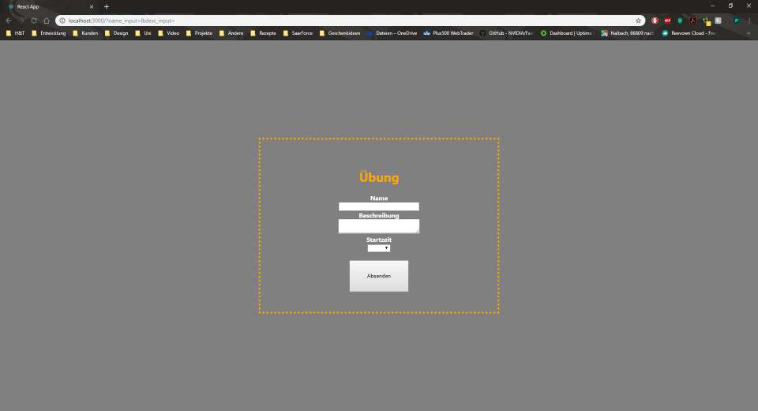

<!-- Seite 36 -->

Kapitel 5 - Eventplaner 
 
In den folgenden Übungsblättern werden Sie einen Eventplaner programmieren. In dieser 
Übung erstellen Sie das Grundgerüst, welches später mit einer API versehen wird, um die 
Kommunikation mit einem Server zu ermöglichen. 
 
5.1. Listen 
 
Bevor Sie mit der Konstruktion des Eventplaners beginnen können, gibt es noch einen kleinen 
Exkurs zum Thema Listen in React. 
Sie werden zunächst eine einfache Liste mit einer ID und einem Namen pro Eintrag erstellen. 
Dazu definieren Sie folgende Variablen im Konstruktor: 
 
Abbildung 43: Variablendefinition 
 
Das Array „events“ werden Sie später programmatisch füllen, doch für den Moment füllen Sie 
es zum Testen erstmal mit folgenden Einträgen: 
 
Abbildung 44: Platzhaltereinträge 
 
 
 
constructor(props){ 
       super(props); 
       this.state = { 
           id: 0, 
           Name: '', 
           events:[] 
       } 
   } 
events:[ 
               {id: 0, name:"Eintrag 1"}, 
               {id: 1, name:"Eintrag 2"}, 
               {id: 2, name:"Eintrag 3"} 
           ]

<!-- Seite 37 -->

Erstellen Sie nun die Funktionen zum Ändern der Variablen - „id“ sollte dabei automatisch 
hochzählen bei Funktionsaufruf – sowie ein Formular zum Eingeben eines Namens, inklusive 
„Submit“-Button: 
 
Abbildung 45: Listenformular 
 
Unterhalb des Formulars erstellen Sie nun eine leere Liste, die Sie später füllen: 
 
Abbildung 46: Leere Liste 
Um die Liste später füllen zu können, benutzen Sie die sogenannte Mapping-Funktion. Dabei 
werden die einzelnen Teile eines Objekts innerhalb der Liste auf ein vorher definiertes 
Listenelement gesetzt und dieses wird innerhalb der Liste angezeigt. 
Zunächst erstellen Sie das benötigte Listenelement als Komponente: 
 
Abbildung 47: Listenelement 

 
               <ul> 
                   { 
                        
                   } 
               </ul> 
               
 
import React from 'react'; 
const event = (props) => { 
   return ( 
   
 
       <li> 
           name= {props.children}, id= {props.id} 
       </li> 
   
 
   ) 
} 
export default event;

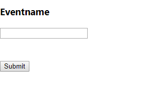

<!-- Seite 38 -->

Das Listenelement wird als Konstante Funktion definiert und es werden die „props“, die Sie 
bereits kennen gelernt haben übergeben. Innerhalb des returns wird nun ein Div-Container mit 
einem Listenelement erzeugt und zurückgegeben. Innerhalb des Listenelements werden Name 
und ID aus den „props“ gemapped.  
Um nun auf das Listenelement zugreifen zu können, müssen Sie noch eine entsprechende 
Funktion in Ihre Liste integrieren: 
 
Code-Fragment 48: Listenelement in Liste einbinden 
Innerhalb der Liste wird nun der Mapping-Befehl aufgerufen. Als Parameter wird das Array 
mit den Elementen übergeben. Innerhalb des returns werden nun die verschiedenen Teile jedes 
Objekts innerhalb des Arrays gemapped und mit Hilfe des vorhin erzeugten Listenelements 
gerendert. 
Der Mapping-Befehl läuft automatisch das komplette Array durch und erstellt pro Eintrag ein 
neues Listenelement. 
Sie können Ihr Programm nun starten. Es wird eine Liste mit den Platzhalterelementen 
angezeigt. Diese kann jedoch weder erweitert, noch können Elemente gelöscht werden. Diese 
Funktionen werden Sie nun implementieren: 
 
 

 
<ul> 
      
{ 
      
 
this.state.events.map( (event)=>{ 
               
 
return(<Event  
                         
id = {event.id} 
                   
 
>{event.name}</Event>) 
})   
} 
</ul> 

<!-- Seite 39 -->

Dazu benötigen Sie zunächst entsprechende Funktionen, um neue Elemente erzeugen und 
löschen zu können: 
 
Abbildung 49: Add und Delete Events 
 
 
 
deleteEvent = (key, eid) => { 
       const events = Object.assign([], this.state.events); 
       console.log(eid, events); 
       for (var i in  events){ 
           if(events[i][key] === eid){ 
               events.splice(i, 1); 
           } 
       } 
       this.setState({events:events}); 
   } 
    
   addEvent(names){ 
       this.state.events.push({id:this.state.id, name:names}) 
       this.changeId(); 
   }

<!-- Seite 40 -->

Diese Funktionen müssen Sie nun noch in Ihre Liste und Ihr Formular einbinden: 
 
Abbildung  50: Einbindung Add und Delete 
 
Sie sind nun fast fertig.  
Die Delete-Funktion muss jetzt nur noch in Ihr Listenelement eingefügt werden: 
 
Abbildung 51: Einbindung Delete Listenelement 

 

 
      
<form> 
            
<h3>Eventname</h3> 
<input type="text" value={this.state.Name}  
onChange={ (e)=>this.changeName(e.target.value)}/>   
                      
<button type="button" onClick={ ()=> this.addEvent 
(this.state.Name)}>Submit</button> 
           </form> 
    
 
     
 
      
<ul> 
            
{ 
                  
this.state.events.map( (event)=>{ 
                        
return(<Event  
                              id = {event.id} 
delEvent={ () => this.deleteEvent 
("id", event.id)} 
                              >{event.name}</Event>) 
               
 
})   
                  } 
           </ul> 
     
 

 
import React from 'react'; 
const event = (props) => { 
   return ( 
   
 
       <li> 
name= {props.children}, id= 
{props.id} 
       </li> 
   
 
   ) 
} 
export default event;

<!-- Seite 41 -->

Löschen Sie nun noch die Platzhaltereinträge von vorhin und Sie können Ihr Programm starten. 
Die Liste ist nun erweiterbar und die Elemente können mit einem Klick auf selbige wieder 
gelöscht werden.  
Hier nochmal der vollständige Code: 
 
import React, {Component} from 'react'; 
import Event from './event'; 
export default class EventList extends Component{ 
   constructor(props){ 
       super(props); 
       this.state = { 
           id: 0, 
           Name: '', 
           events:[ 
               {id: 0, name:"Eintrag 1"}, 
               {id: 1, name:"Eintrag 2"}, 
               {id: 2, name:"Eintrag 3"} 
           ] 
       } 
   } 
   changeId(){ 
       var tid = this.state.id + 1; 
       this.setState({id:tid}) 
   } 
   changeName(input){ 
       this.setState({Name : input}); 
   } 
    
   deleteEvent = (key, eid) => { 
       const events = Object.assign([], this.state.events); 
       console.log(eid, events); 
       for (var i in  events){ 
           if(events[i][key] === eid){ 
               events.splice(i, 1); 
           } 
       } 
       this.setState({events:events}); 
   } 
    
   addEvent(names){ 
       this.state.events.push({id:this.state.id, name:names}) 
       this.changeId(); 
   }

<!-- Seite 42 -->

Abbildung 52: EventList.js 
 
 
Abbildung 53: event.js 
 
render(){ 
       return( 
           
 
               
 
                   <form> 
                       <h3>Eventname</h3> 
                       <input type="text" value={this.state.Name} onChange={ 
(e)=>this.changeName(e.target.value)}/>   
                            
                       <button type="button" onClick={ ()=> 
this.addEvent(this.state.Name)}>Submit</button> 
                   </form> 
               
 
               
 
               <ul> 
                   { 
                       this.state.events.map( (event)=>{ 
                           return(<Event  
                               id = {event.id} 
                               delEvent={ () => this.deleteEvent("id", 
event.id)} 
                               >{event.name}</Event>) 
                   })   
                   } 
               </ul> 
               
 
           
 
       ); 
   } 
} 
import React from 'react'; 
const event = (props) => { 
   return ( 
   
 
       <li> 
           name= {props.children}, id= 
{props.id} 
       </li> 
   
 
   ) 
} 
export default event;

<!-- Seite 43 -->

Aufgabe 5 
 
Erstellen Sie folgende Oberfläche: 
 
 
Abbildung 54: Eventplaner Oberfläche 
 
Die Größen sind Ihnen freigestellt. Der Inhalt der grünen Box ist eine Liste, die später 
programmatisch gefüllt wird. 
Als nächstes teilen Sie den Oberflächen noch Funktionen zu. Mit Klick auf den Button 
„Submit“ soll ein neuer Eintrag in der Liste hinzugefügt werden. Jeder Eintrag soll mit Klick 
auf selbigen gelöscht werden.

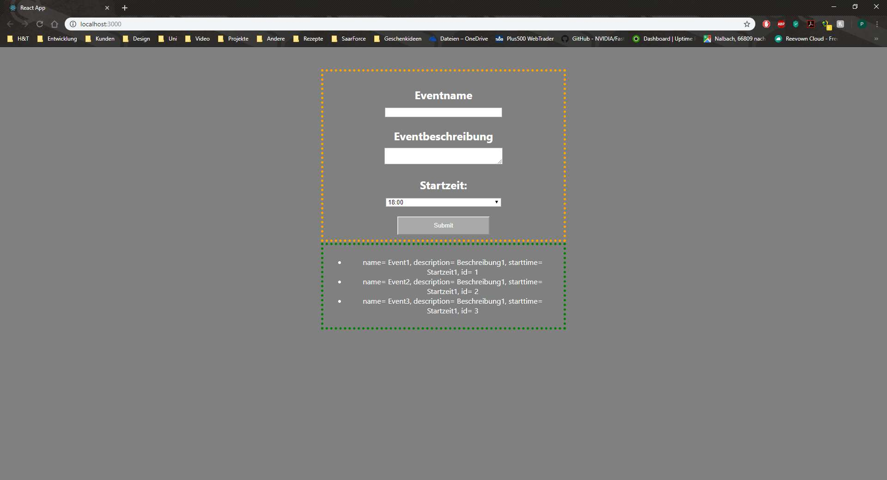

<!-- Seite 44 -->

Kapitel 6 - Verwendung einer REST-API 
 
Für viele Projekte werden REST-APIs verwendet, um Daten zu übergeben. Die Verwendung 
dieser in React werden Sie in dieser Übung lernen. 
Bei API-Calls gibt es verschiedene Arten eines Calls: GET, POST, PUT und DELETE. Mit 
GET werden vorhandene Daten vom Server abgerufen. Mit POST werden neue erzeugt, mit 
PUT werden vorhandene Daten geändert und mit DELETE gelöscht. 
Um verschiedene APIs zu zeigen, werden Sie den GET-Request mit Hilfe der AXIOS-API 
erstellen. Dazu öffnen Sie innerhalb Ihres Projekts in Visual Studio Code ein neues Terminal 
und führen folgenden Befehl aus: 
 
Der Request an sich hat folgende Parameter: 
 
Abbildung 55: Fetch GET-Request 
 
Innerhalb des Request wird von einer URL ein JSON-String (nähere Informationen zu JSON-
String finden Sie hier: https://www.json.org/ ) abgerufen, welcher alle Einträge in der 
Datenbank enthält. Dieser String wird anschließend gemapped und kann somit verwendet 
werden. 
 
 
npm install axios --save 
componentDidMount() { 
       axios.get(`http://localhost:3000/api/event`) 
         .then(res => { 
           this.setState({ events:res.date }); 
         }) 
     }

<!-- Seite 45 -->

POST: 
Für ein POST-Request benötigen Sie Daten, die zum Server gesendet werden können: 
 
Code-Fragment 56: Fetch POST-Request 
Das Objekt „myPost“ wird mit Hilfe von „JSON.stringify“ in einen JSON-String umgewandelt. 
Die Methode gibt hierbei an, was passieren soll. Hier können POST, PUT oder DELETE 
verwendet werden. Mit dem anschließenden „fetch“ wird der Befehl auf dem Server 
ausgeführt. 
Was ist Axios und warum sollten Sie es verwenden? Axios ist eine JavaScript-Library, die 
XMLHTTP-Requests vereinfachen soll. Außerdem werden automatische Transformationen 
von JSON-Strings unterstützt.  
Grundsätzlich können Sie jederzeit Axios und Fetch verwenden. Axios macht einiges leichter, 
wobei man durch die Einbindung externen Quellen immer eine gewisse Abhängigkeit 
entwickelt. 
 
 
const myPost = { 
   title: 'A post about true facts', 
   body: '42', 
   userId: 2 
 } 
  
 const options = { 
   method: 'POST', 
   body: JSON.stringify(myPost), 
   headers: { 
     'Content-Type': 'application/json' 
   } 
 }; 
  
 fetch('https://jsonplaceholder.typicode.com/posts', options) 
   .then(res => res.json())

<!-- Seite 46 -->

Aufgabe 6 
 
Ändern Sie das Formular aus der vorherigen Übung so ab, dass es zu der dieser Übung 
beiliegenden REST-API passt. Achten Sie auf das Datumsformat! Das Formular sollte mit der 
REST-API kommunizieren können. Implementieren Sie die benötigten Funktionen.

<!-- Seite 47 -->

Kapitel 7 – Lösungen 
 
Aufgabe 1 – Lösung 
 
 
Abbildung 57: Aufgabe 1 - Lösung 
 
 
<?xml version=“1.0“ encoding=“ISO-8859-1“ standalone=“yes“ ?> 
<auto> 
   <marke>Audi</marke> 
   <modell>A4</modell> 
   <typ>Kombi</typ> 
   <motor> 
       <zylinder>4</zylinder> 
       <leistung>120</leistung> 
   </motor> 
   <reifen> 
       <hersteller>Goodyear</hersteller> 
       <druck>2,3</druck> 
   </reifen> 
</auto>

<!-- Seite 48 -->

Aufgabe 2 – Lösung 
 
 
Abbildung 58: Aufgabe 2 - Lösung 
 
 
import React, { Component } from 'react'; 
class NameForm extends Component { 
   state = {  } 
   constructor(props){ 
       super(props); 
       this.state = { 
           input: '', 
       } 
       this.updateInput  = this.updateInput.bind(this); 
   } 
   updateInput(event){ 
       this.setState({input : event.target.value}) 
   } 
   render() {  
       return (  
           <form> 
               <h1>Binding Beispiel</h1> 
               <label><b>{this.state.input}</b></label>   
               <input type="text" name="name_input" 
                       onChange={this.updateInput}></input>   
           </form> 
        ); 
   } 
} 
export default NameForm;

<!-- Seite 49 -->

Aufgabe 3 – Lösung 
 
 
import React, { Component } from 'react'; 
class NameForm extends Component { 
   state = {  } 
   constructor(props){ 
       super(props); 
       this.state = { 
           name: '', 
           desc: '', 
           time: '' 
       } 
       this.handleClick = this.handleClick.bind(this); 
       this.updateName  = this.updateName.bind(this); 
       this.updateDesc = this.updateDesc.bind(this); 
       this.updateTime = this.updateTime.bind(this); 
   } 
   handleClick() 
   { 
       alert("Name: " + this.state.name + "; Beschreibung: "  
       + this.state.desc + "; Startzeit: " + this.state.time); 
   } 
   updateName(event){ 
       this.setState({name : event.target.value}) 
   } 
   updateDesc(event){ 
       this.setState({desc : event.target.value}) 
   } 
   updateTime(event){ 
       this.setState({time : event.target.value}) 
   }

<!-- Seite 50 -->

Abbildung 59: Aufgabe 3 - Lösung 
 
 
render() {  
       return (  
           <form> 
               <h1>Übung</h1> 
               <label><b>Name</b></label>   
               <input type="text" name="name_input"  
                       onChange={this.updateName}></input>   
               <label><b>Beschreibung</b></label>   
               <textarea type="text" name="desc_input"  
                       onChange={this.updateDesc}></textarea>   
               <label><b>Startzeit</b></label>   
               <select onChange={this.updateTime}> 
                   <option value=""></option> 
                   <option value="8am">8:00</option> 
                   <option value="12am">12:00</option> 
                   <option value="4pm">16:00</option> 
               </select>   
               <button onClick={this.handleClick}>Absenden</button> 
           </form> 
        ); 
   } 
} 
export default NameForm;

<!-- Seite 51 -->

Aufgabe 4 – Lösung 
 
 
import React, { Component } from 'react'; 
import './style.css'; 
const titlestyle = { 
   color: 'orange', 
}; 
const labelstyle = { 
   color: 'white', 
}; 
const boxstyle = { 
   width: '200px', 
}; 
const buttonstyle = { 
   width: '150px', 
   height: '80px', 
}; 
class NameForm extends Component { 
   state = {  } 
   constructor(props){ 
       super(props); 
       this.state = { 
           name: '', 
           desc: '', 
           time: ''

<!-- Seite 52 -->

} 
       this.handleClick = this.handleClick.bind(this); 
       this.updateName  = this.updateName.bind(this); 
       this.updateDesc = this.updateDesc.bind(this); 
       this.updateTime = this.updateTime.bind(this); 
   } 
   handleClick() 
   { 
       alert("Name: " + this.state.name + "; Beschreibung: "  
       + this.state.desc + "; Startzeit: " + this.state.time); 
   } 
   updateName(event){ 
       this.setState({name : event.target.value}) 
   } 
   updateDesc(event){ 
       this.setState({desc : event.target.value}) 
   } 
   updateTime(event){ 
       this.setState({time : event.target.value}) 
   } 
   render() {  
       return (  
           
 
           
 
               <form> 
                   <h1 style={titlestyle}>Übung</h1> 
                   <label style={labelstyle}><b>Name</b></label>   
                   <input type="text" name="name_input"  
                       onChange={this.updateName} 
style={boxstyle}></input>   
                   <label 
style={labelstyle}><b>Beschreibung</b></label>   
                   <textarea type="text" name="desc_input"  
                       onChange={this.updateDesc} 
style={boxstyle}></textarea>   
                   <label 
style={labelstyle}><b>Startzeit</b></label>   
                   <select onChange={this.updateTime}> 
                       <option value=""></option> 
                       <option value="8am">8:00</option> 
                       <option value="12am">12:00</option> 
                       <option value="4pm">16:00</option> 
                   </select>     
                   <button onClick={this.handleClick} style = 
{buttonstyle}>Absenden</button> 
               </form>

<!-- Seite 53 -->

Abbildung 57: Aufgabe 4 – Lösung 
 
 
 
Abbildung 58: Aufgabe 4 – Lösung: style.css 
 
 
 
           
 
           
 
        ); 
   } 
} 
export default NameForm; 
.content{ 
   width: 100vw; 
   height: 100vh; 
   background-color: grey; 
} 
.formular { 
   position: absolute; 
   min-width: 500px; 
   padding: 50px; 
   top: 50%; 
   left: 50%; 
   transform: translate(-50%, -50%); 
   border: 5px dotted orange; 
   text-align: center; 
 }

<!-- Seite 54 -->

Aufgabe 5 - Lösung 
 
 
import React, {Component} from 'react'; 
import Event from './event'; 
import './style.css'; 
const boxstyle= { 
   width: '50%', 
} 
const selstyle= { 
   width: '50%', 
   textAlign: 'center', 
} 
const butstyle= { 
   background: 'darkgrey', 
   color: 'white', 
   width: '40%', 
   height: '40px', 
} 
export default class EventList extends Component{ 
   constructor(props){ 
       super(props); 
       this.state = { 
           idc: 0, 
           inputName: '', 
           inputDesc: '', 
           inputTime: '18:00', 
           events:[] 
       } 
   } 
   changeInputName(input){ 
       this.setState({inputName : input}); 
   } 
   changeInputDesc(input){ 
       this.setState({inputDesc : input}); 
   } 
   changeInputTime(input){ 
       this.setState({inputTime : input}); 
   } 
   deleteEvent = (key, eid) => { 
       const events = Object.assign([], this.state.events); 
       console.log(eid, events); 
       for (var i in  events){ 
           if(events[i][key] == eid){ 
               events.splice(i, 1);

<!-- Seite 55 -->

} 
       } 
       this.setState({events:events}); 
   } 
   changeIdc(){ 
       var id = this.state.idc + 1; 
       this.setState({idc:id}) 
   } 
   addEvent(names, desc, time){ 
       this.state.events.push({id:this.state.idc, name:names, descrip-
tion:desc, starttime:time}) 
       this.changeIdc(); 
   } 
   render(){ 
       return( 
           
 
               
 
                   <form> 
                       <h3>Eventname</h3> 
                       <input style={boxstyle} type="text" va-
lue={this.state.inputName} onChange={ (e)=>this.changeInputName(e.target.va-
lue)}/>   
                       <h3>Eventbeschreibung</h3> 
                       <textarea style={boxstyle} type="text" va-
lue={this.state.inputDesc} onChange={(e)=> this.changeInputDesc(e.target.va-
lue)}/>   
                       <h3>Startzeit: </h3> 
                       <select style={selstyle} value={this.state.inputTime} 
onChange={(e)=> this.changeInputTime(e.target.value)}> 
                           <option value="18:00">18:00</option> 
                           <option value="19:00">19:00</option> 
                           <option value="20:00">20:00</option> 
                           <option value="21:00">21:00</option> 
                           <option value="22:00">22:00</option> 
                       </select> 
                            
                       <button type="button" style={butstyle} onClick={ ()=> 
this.addEvent(this.state.inputName, this.state.inputDesc, this.state.input-
Time)}>Submit</button> 
                   </form> 
               
 
               

<!-- Seite 56 -->

Code-Fragment 60: Aufgabe 5 – Lösung: EventList.js 
 
 
Code-Fragment 61: Aufgabe 5 – Lösung: event.js 
 
 
<ul> 
                   { 
                       this.state.events.map( (event)=>{ 
                           return(<Event  
                               description = {event.description} 
                               id = {event.id} 
                               delEvent={ () => this.deleteEvent("id", 
event.id)} 
                               starttime = {event.starttime} 
                               >{event.name}</Event>) 
                       }) 
                   } 
               </ul> 
               
 
           
 
       ); 
   } 
} 
import React from 'react'; 
import './style.css'; 
const event = (props) => { 
   return ( 
   
 
       <li> 
           name= {props.children}, 
description= {props.description},  starttime= {props.starttime}, id= 
{props.id} 
       </li> 
   
 
   ) 
} 
export default event;

<!-- Seite 57 -->

Code-Fragment 62: Aufgabe 5 – Lösung: style.css 
 
 
 
#myspan:hover * { 
   background: orange; 
} 
.eventlistmain { 
   width: 100vw;  
   height: 100vh; 
   padding-top: 100px; 
   background-color: grey; 
} 
.InputForm {  
   width: 500px;  
   padding: 10px;  
   position: relative;  
   left: 50%; 
   transform: translateX(-50%); 
   border: 5px dotted orange;  
   text-align: center;  
   color: white; 
} 
.eventList {  
   width: 500px;  
   padding: 10px;  
   align: center; 
   position: relative;  
   left: 50%; 
   transform: translateX(-50%); 
   border: 5px dotted green;  
   text-align: center;  
   color: white; 
} 
h3{ 
   font-size: x-large; 
   margin-bottom: 10px; 
}

<!-- Seite 58 -->

Aufgabe 6 – Lösung  
 
 
Code-Fragment 63: Aufgabe 6 – Lösung: event.js 
 
 
import React from 'react'; 
import './style.css'; 
const event = (props) => { 
   return ( 
   
 
       <li> 
           title= {props.children}, expires= 
{props.expires}, id= {props.id} 
       </li> 
   
 
   ) 
} 
export default event; 
import React, {Component} from 'react'; 
import Event from './event'; 
import axios from 'axios'; 
import './style.css'; 
const boxstyle= { 
   width: '51%', 
} 
const selstyle2= { 
   width: '17%', 
   textAlign: 'center', 
} 
const butstyle= { 
   background: 'darkgrey', 
   color: 'white', 
   width: '40%', 
   height: '40px', 
}

<!-- Seite 59 -->

export default class EventList extends Component{ 
   constructor(props){ 
       super(props); 
       this.state = { 
           inputName: '', 
           inputDesc: '', 
           inputDay: '', 
           inputMonth: '', 
           inputYear: '', 
           expires:'', 
           events:[] 
       } 
   } 
   changeInputName(input){ 
       this.setState({inputName : input}); 
   } 
   changeInputDesc(input){ 
       this.setState({inputDesc : input}); 
   } 
   changeInputDay(input){ 
       this.setState({inputDay : input}); 
   } 
   changeInputMonth(input){ 
       this.setState({inputMonth : input}); 
   } 
   changeInputYear(input){ 
       this.setState({inputYear : input}); 
   } 
   deleteEvent = (key, eid) => { 
       const events = Object.assign([], this.state.events); 
       for (var i in  events){ 
           if(events[i][key] === eid){ 
               this.deleteItem(eid); 
           } 
       } 
   } 
   deleteItem(ids){ 
       var url = "http://localhost:5080/api/event/"+ids; 
       return fetch(url, { 
           method: 'delete' 
         })

<!-- Seite 60 -->

.then(response => response.json().then(json => {return json;})) 
         .then(window.location.reload()); 
       } 
    
   handleSubmit = subevent =>{ 
       const myPost = { 
           title: this.state.inputName, 
           description: this.state.inputDesc, 
           expires: this.state.inputYear+'-'+this.state.inputMonth+'-
'+this.state.inputDay 
         } 
         console.log(JSON.stringify(myPost)) 
          
         const options = { 
           method: 'POST', 
           body: JSON.stringify(myPost), 
           headers: { 
             'Content-Type': 'application/json' 
           } 
         }; 
          
         fetch('http://localhost:5080/api/event/create', options) 
           .then(res => res.json()) 
           .then(console.log("done")) 
           .then(window.location.reload()) 
           .catch(error => this.setState({ error, isLoading: false })) 
   } 
   componentDidMount() { 
       axios.get(`http://localhost:5080/api/event`) 
         .then(res => {this.setState({ events:res.data }); 
         }) 
     } 
   render(){ 
       return( 
           
 
               
 
                   <form> 
                       <h3>Name</h3> 
                       <input style={boxstyle} type="text" 
value={this.state.inputName} onChange={ 
(e)=>this.changeInputName(e.target.value)}/>   
                       <h3>Beschreibung</h3> 
                       <textarea style={boxstyle} type="text" 
value={this.state.inputDesc} onChange={(e)=> 
this.changeInputDesc(e.target.value)}/>   
                       <h3>Datum</h3>

<!-- Seite 61 -->

<select style={selstyle2} value={this.state.inputDay} onChange={(e)=> 
this.changeInputDay(e.target.value)}> 
                           <option value=""></option> 
                           <option value="01">01</option> 
                           <option value="02">02</option> 
                           <option value="03">03</option> 
                           <option value="04">04</option> 
                           <option value="05">05</option> 
                           <option value="06">06</option> 
                           <option value="07">07</option> 
                           <option value="08">08</option> 
                           <option value="09">09</option> 
                           <option value="10">10</option> 
                           <option value="11">11</option> 
                           <option value="12">12</option> 
                           <option value="13">13</option> 
                           <option value="14">14</option> 
                           <option value="15">15</option> 
                           <option value="16">16</option> 
                           <option value="17">17</option> 
                           <option value="18">18</option> 
                           <option value="19">19</option> 
                           <option value="20">20</option> 
                           <option value="21">21</option> 
                           <option value="22">22</option> 
                           <option value="23">23</option> 
                           <option value="24">24</option> 
                           <option value="25">25</option> 
                           <option value="26">26</option> 
                           <option value="27">27</option> 
                           <option value="28">28</option> 
                           <option value="29">29</option> 
                           <option value="30">30</option> 
                           <option value="31">31</option> 
                       </select> 
                       <select style={selstyle2} 
value={this.state.inputMonth} onChange={(e)=> 
this.changeInputMonth(e.target.value)}> 
                           <option value=""></option> 
                           <option value="01">Januar</option> 
                           <option value="02">Februar</option> 
                           <option value="03">März</option> 
                           <option value="04">April</option> 
                           <option value="05">Mai</option> 
                           <option value="06">Juni</option> 
                           <option value="07">Juli</option> 
                           <option value="08">August</option> 
                           <option value="09">Spemteber</option>

<!-- Seite 62 -->

Code-Fragment 64: Aufgabe 6 – Lösung:  EventList.js 
 
 
<option value="10">Oktober</option> 
                           <option value="11">November</option> 
                           <option value="12">Dezember</option> 
                       </select> 
                       <select style={selstyle2} value={this.state.inputYear} 
onChange={(e)=> this.changeInputYear(e.target.value)}> 
                       <option value=""></option> 
                           <option value="2019">2019</option> 
                           <option value="2020">2020</option> 
                           <option value="2021">2021</option> 
                           <option value="2022">2022</option> 
                           <option value="2023">2023</option> 
                       </select> 
                            
                       <button type="Submit" style={butstyle} 
onClick={this.handleSubmit}>Submit</button> 
                   </form> 
               
 
               
 
               <ul> 
                   { 
                       this.state.events.map( (event)=>{ 
                           return(<Event  
                               id = {event.id} 
                               delEvent={ () => this.deleteEvent("id", 
event.id)} 
                               expires = {event.expires} 
                               >{event.title}</Event>) 
                       }) 
                   } 
               </ul> 
               
 
           
 
       ); 
   } 
}

<!-- Seite 63 -->

Wir hoffen, Sie hatten Spaß an dieser Einführung in das Framework React und konnten einige 
neue Kenntnisse gewinnen.  
 
Philipp Lauer, Marc Zintel

<!-- Seite 64 -->

Referenzen 
 
TechMagic. (2018). Medium.com. Von Medium.com: https://medium.com/@TechMagic/reactjs-vs-
angular5-vs-vue-js-what-to-choose-in-2018-b91e028fa91d zuletzt aufgerufen 15.05.2020 
Airbnb Logo, Airbnb, Inc.: https://www.airbnb.de/ zuletzt aufgerufen 15.05.2020 
 
Dropbox Logo, Dropbox International Unlimited Company: https://www.dropbox.com/ zuletzt aufgerufen 
15.05.2020 
 
Facebook Logo, Facebook Inc.: https://www.facebook.com/ zuletzt aufgerufen 15.05.2020 
 
Instagram Logo, Instagram von Facebook: https://www.instagram.com/  zuletzt aufgerufen 15.05.2020 
 
Netflix Logo,  Netflix, Inc.: https://www.netfliix.com/  zuletzt aufgerufen 15.05.2020 
 
React Logo, Facebook Inc.: https://www.reactjs.org/  zuletzt aufgerufen 15.05.2020 
 
Whatsapp Logo, Whatsapp Inc.: https:/www.whatsapp.com/  zuletzt aufgerufen 15.05.2020 
 
Yahoo! Logo, Verizon Media.: https://www.yahoo.com/ zuletzt aufgerufen 15.05.2020

<!-- Seite 65 -->

Abbildungsverzeichnis 
 
Abbildung 1: Einige bekannte Unternehmen, die mit React entwickeln ................................................ 5 
Abbildung 2: Verbreitung Frameworks (Quelle: TechMagic. (2018)) ...................................................... 6 
Abbildung 3: React Architektur (Quelle: TechMagic. (2018)) ................................................................. 6 
Abbildung 4: DOM Baumstruktur ............................................................................................................ 7 
Abbildung 5: Visual Studio Code ........................................................................................................... 10 
Abbildung 6: Terminal Übersicht .......................................................................................................... 10 
Abbildung 7: Baumdiagramm für Codebeispiel .................................................................................... 11 
Abbildung 8: Codebeispiel für XML ....................................................................................................... 11 
Abbildung 9: Aufgabe 1 ......................................................................................................................... 12 
Abbildung 10: TypeOf verschiedener Variablen ................................................................................... 13 
Abbildung 11: Beispiel Rechenoperatoren ............................................................................................ 14 
Abbildung 12: Beispiel Vergleichsoperatoren ....................................................................................... 14 
Abbildung 13: Beispiel typgenauer Vergleich ....................................................................................... 14 
Abbildung 14: Arrays Beispiel ............................................................................................................... 15 
Abbildung 15: Objects Beispiel .............................................................................................................. 15 
Abbildung 16: Functions Beispiel .......................................................................................................... 16 
Abbildung 17: If-Else Beispiel ................................................................................................................ 17 
Abbildung 18: Beispiel einer For-Schleife ............................................................................................. 17 
Abbildung 19: Beispiel Exception .......................................................................................................... 18 
Abbildung 20: Beispiel Eventhandling ................................................................................................... 18 
Abbildung 21: Aufbau einer React-App ................................................................................................. 19 
Abbildung 22: Ordner erstellen für Komponenten ............................................................................... 20 
Abbildung 23: Neue Datei im Ordner erstellen ..................................................................................... 20 
Abbildung 24: Autocomplete import .................................................................................................... 20 
Abbildung 25: React import .................................................................................................................. 21 
Abbildung 26: Klasse erstellen in Komponente .................................................................................... 21 
Abbildung 27: Komponente in index.js importieren ............................................................................. 21 
Abbildung 28: Eventhandling in HTML .................................................................................................. 22 
Abbildung 29: Eventhandling in React .................................................................................................. 22 
Abbildung 30: App.js mit Parent Komponente und Hauptklasse .......................................................... 23 
Abbildung 31: ChildComponent.js mit Kind Komponente .................................................................... 24 
Abbildung 32: Übung Binding ............................................................................................................... 25 
Abbildung 33: Einfaches HTML-Formular ............................................................................................. 26 
Abbildung 34: Controlled Component - Formular Beispiel ................................................................... 27 
Abbildung 35: Textarea HTML ............................................................................................................... 28 
Abbildung 36: Textarea mit Submit in React ......................................................................................... 28 
Abbildung 37: HTML-Dropdown Beispiel .............................................................................................. 29 
Abbildung 38: React Dropdown Menü .................................................................................................. 30 
Abbildung 39: CSS-Import ..................................................................................................................... 32 
Abbildung 40: CSS-Beispielsheet ........................................................................................................... 32 
Abbildung 41: Inline-Style Beispiel ........................................................................................................ 33 
Abbildung 42: Übung Styling ................................................................................................................. 34 
Abbildung 43: Variablendefinition ........................................................................................................ 35 
Abbildung 44: Platzhaltereinträge ........................................................................................................ 35 
Abbildung 45: Listenformular ............................................................................................................... 36

<!-- Seite 66 -->

Abbildung 46: Leere Liste ...................................................................................................................... 36 
Abbildung 47: Listenelement ................................................................................................................ 36 
Code-Fragment 48: Listenelement in Liste einbinden .......................................................................... 37 
Abbildung 49: Add und Delete Events .................................................................................................. 38 
Abbildung  50: Einbindung Add und Delete .......................................................................................... 39 
Abbildung 51: Einbindung Delete Listenelement .................................................................................. 39 
Abbildung 52: EventList.js ..................................................................................................................... 41 
Abbildung 53: event.js .......................................................................................................................... 41 
Abbildung 54: Eventplaner Oberfläche ................................................................................................. 42 
Abbildung 55: Fetch GET-Request ......................................................................................................... 43 
Code-Fragment 56: Fetch POST-Request .............................................................................................. 44 
Abbildung 57: Aufgabe 1 - Lösung ........................................................................................................ 46 
Abbildung 58: Aufgabe 2 - Lösung ........................................................................................................ 47 
Abbildung 59: Aufgabe 3 - Lösung ........................................................................................................ 49 
Code-Fragment 60: Aufgabe 5 – Lösung: EventList.js ........................................................................... 55 
Code-Fragment 61: Aufgabe 5 – Lösung: event.js ................................................................................ 55 
Code-Fragment 62: Aufgabe 5 – Lösung: style.css ................................................................................ 56 
Code-Fragment 63: Aufgabe 6 – Lösung: event.js ................................................................................ 57 
Code-Fragment 64: Aufgabe 6 – Lösung:  EventList.js .......................................................................... 61
